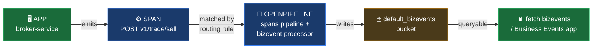

# Business Events from Spans — OpenPipeline Guide

A complete, customer-ready walkthrough for creating Dynatrace business events (bizevents) from span data using OpenPipeline, and validating those events end-to-end via DQL and the Business Events app.

---

## Table of Contents

1. [What are Business Events?](#what-are-business-events)
2. [Spans vs. Bizevents — When to Use Which](#spans-vs-bizevents--when-to-use-which)
3. [Core Concepts](#core-concepts)
4. [Prerequisites](#prerequisites)
5. [Step-by-Step: Create a Spans-to-Bizevent Rule](#step-by-step-create-a-spans-to-bizevent-rule)
   - [Step 1 — Open OpenPipeline](#step-1--open-openpipeline)
   - [Step 2 — Create a new spans pipeline](#step-2--create-a-new-spans-pipeline)
   - [Step 3 — Add the bizevent processor](#step-3--add-the-bizevent-processor)
   - [Step 4 — Configure the matcher](#step-4--configure-the-matcher)
   - [Step 5 — Set event type and provider](#step-5--set-event-type-and-provider)
   - [Step 6 — Configure field extraction](#step-6--configure-field-extraction)
   - [Step 7 — Save the pipeline](#step-7--save-the-pipeline)
6. [Step-by-Step: Configure the Routing Rule](#step-by-step-configure-the-routing-rule)
7. [Field Mapping Reference](#field-mapping-reference)
8. [Validation — DQL Queries](#validation--dql-queries)
9. [Validation — Business Events App (UI)](#validation--business-events-app-ui)
10. [Worked Example — EasyTrade `broker-service`](#worked-example--easytrade-broker-service)
11. [Common Patterns & Recipes](#common-patterns--recipes)
12. [Troubleshooting](#troubleshooting)
13. [Tips](#tips)
14. [Quick Reference Card](#quick-reference-card)
15. [Further Reading](#further-reading)

---

## What are Business Events?

A **business event** (bizevent) is a discrete, business-meaningful record — a checkout, a deposit, a credit-card order, a trade execution. Bizevents live in their own Grail bucket (`default_bizevents`) and are queryable via `fetch bizevents`. They follow the [CloudEvents](https://cloudevents.io/) schema, so every event has at minimum a `timestamp`, an `event.type`, an `event.provider`, and an `event.id`.

OpenPipeline's **bizevent processor** lets you derive business events directly from spans your applications already emit. No application changes, no extra SDK — just a matcher and a field mapping.



The flow has two pieces of configuration you will create in this guide:

1. **A spans pipeline** with a **bizevent processor** under the Data extraction stage.
2. **A routing rule** that directs the matching spans into your pipeline.

---

## Spans vs. Bizevents — When to Use Which

| Aspect | Spans | Bizevents |
|---|---|---|
| **Primary use** | Distributed tracing, latency, error rates | Business records: orders, trades, signups |
| **Storage bucket** | `default_spans` (or custom) | `default_bizevents` (or custom) |
| **Retention default** | Tenant-defined, typically days | Tenant-defined, often longer (months/years) |
| **Schema** | OpenTelemetry span model | CloudEvents (`event.type`, `event.provider`, `event.id`, `timestamp`) |
| **Sampling** | Heavy — sampled at ingest, can be 1% | None by default — every event is kept |
| **Queryable via** | `fetch spans` / `timeseries` | `fetch bizevents` / Business Events app |
| **Cost model** | DPS at ingest + query | Events at ingest + query (priced separately) |

**Use spans-to-bizevents when:** you already have span coverage, want to materialize business signals from existing telemetry, and want those signals retained beyond span retention. Common scenarios — derive a `com.<domain>.trade.executed` event from a `/v1/trade/sell` server span, or a `com.<domain>.order.placed` event from a `POST /orders` span.

> **Note:** Bizevents are not a replacement for emitting events from application code via the [Business Events ingest API](https://docs.dynatrace.com/docs/observe/business-observability/bo-api-ingest). Use the API when you need fields that aren't on the span (e.g., a precise dollar amount that only the request body contains and was not propagated to a span attribute). Use OpenPipeline span extraction when the data you need is already on the span.

---

## Core Concepts

| Term | Meaning |
|---|---|
| **Bizevent** | A discrete business record stored in the `default_bizevents` bucket and queryable via `fetch bizevents`. |
| **`event.type`** | The kind of event — reverse-DNS convention (e.g. `com.acme.order.placed`). Required. |
| **`event.provider`** | The system that emitted the event (e.g. `com.acme.broker`). Required. |
| **`event.id`** | Unique ID assigned to each event. Auto-generated if not supplied. |
| **`timestamp`** | When the event occurred. Inherited from the span's start time by default. |
| **OpenPipeline pipeline** | A named processing unit. A pipeline has stages (Processing, Metric extraction, Data extraction). |
| **Data extraction stage** | The stage where the **bizevent processor** lives. |
| **Bizevent processor** | The processor type (`bizevent`) that turns a matching record into a bizevent. |
| **Matcher** | A DQL-style filter expression that selects which records the processor acts on. |
| **Routing rule** | A separate setting under **Dynamic routing** that decides which records enter which pipeline. |
| **Field extraction** | The processor sub-config that decides which source fields are copied onto the bizevent, and what they're named. |

---

## Prerequisites

Before you start, confirm three things:

**1. Your spans are reaching Dynatrace.** Run this in a Notebook — substitute your own service/namespace filter:

```dql
fetch spans, from: now()-1h
| filter `k8s.namespace.name` == "<your-namespace>" and span.kind == "server"
| fields span.name, http.route, duration, `dt.entity.service`
| limit 10
```

You should see rows. If you don't, fix span ingest first — bizevent extraction can only work on spans Dynatrace actually receives.

**2. You have permissions to edit OpenPipeline.** You need write access to the `builtin:openpipeline.spans.pipelines` and `builtin:openpipeline.spans.routing` settings schemas. If the **OpenPipeline** menu is read-only or missing, ask your tenant administrator.

**3. You know what business signal you want.** Decide your `event.type` (e.g. `com.acme.broker.request`), your `event.provider` (e.g. `com.acme.broker`), and which span attributes you want carried onto each event (`span.name`, `http.route`, `dt.entity.service`, etc.).

---

## Step-by-Step: Create a Spans-to-Bizevent Rule

### Step 1 — Open OpenPipeline

1. In your Dynatrace tenant, open the left-hand navigation menu.
2. Go to **Settings**.
3. Under **Process and contextualize**, click **OpenPipeline**.
4. In the left sidebar of the OpenPipeline UI, click **Spans**.

You land on the **Pipelines** tab by default.

---

### Step 2 — Create a new spans pipeline

1. On the **Pipelines** tab, click **Add pipeline** (top right).
2. In the **Name** field enter a descriptive name, for example:
   ```
   Broker Service Bizevents
   ```
3. Leave **Custom ID** auto-generated (or set your own — must be 4–100 chars, no whitespace, must not start with `dt.` or `dynatrace.`).
4. Click **Save**.

You are now inside the new pipeline. Three tabs are visible across the top:

- **Processing**
- **Metric extraction**
- **Data extraction** ← you'll use this

---

### Step 3 — Add the bizevent processor

1. Click the **Data extraction** tab.
2. Click **Add processor**.
3. A dropdown appears — select **Business event extraction**.
4. A form panel opens on the right side of the screen.

---

### Step 4 — Configure the matcher

Fill in the top of the form:

| Field | Example Value | Notes |
|---|---|---|
| **Name** | `Broker request → bizevent` | Free text — describes the rule |
| **Custom ID** | `broker-request-bizevent` | Stable ID; will appear in API/YAML exports |
| **Enabled** | ✅ (checked) | Leave on |
| **Matcher** | `` `k8s.namespace.name` == "easytrade" and span.kind == "server" `` | DQL-style filter on incoming spans |

> **The matcher is the single most important field.** It decides which spans become bizevents. Any DQL boolean expression that works in `fetch spans \| filter ...` works here. Test it in a Notebook first (see [Tips](#tips)).

Common matcher patterns:

```
// All server-side spans in a namespace
`k8s.namespace.name` == "shop" and span.kind == "server"

// A specific service
`service.name` == "checkout"

// A specific HTTP route
http.route == "/api/v1/orders" and http.request.method == "POST"

// Only error spans
span.status == "error"
```

---

### Step 5 — Set event type and provider

Both are **required**. Each has an assignment type — you can use a **Constant value** (recommended) or a **Field value** (extract from a span attribute at write-time).

**Event type** — the kind of event:

| Field | Example Value |
|---|---|
| **Assignment type** | Constant value |
| **Value** | `com.acme.broker.request` |

> **Convention:** use reverse-DNS for `event.type` — `com.<company>.<domain>.<action>`. This keeps event types globally unique and self-documenting in dashboards.

**Event provider** — the system emitting the event:

| Field | Example Value |
|---|---|
| **Assignment type** | Constant value |
| **Value** | `com.acme.broker` |

If you want one rule to produce multiple event types (e.g. derive `com.acme.trade.buy` vs. `com.acme.trade.sell` from `http.route`), switch the **Assignment type** to **Field value assignment** and point at the source field:

| Field | Example Value |
|---|---|
| **Assignment type** | Field value assignment |
| **Source field name** | `http.route` |

> **Tip:** for *more than one* event type from a single span set, consider creating *multiple* matchers/processors with constant values instead of one processor with a Field assignment. Constant values keep `event.type` cardinality predictable and reviewable.

---

### Step 6 — Configure field extraction

Under **Field extraction**, you decide which span attributes are carried onto the bizevent.

There are three modes:

| Mode | Behavior | Use when |
|---|---|---|
| **Include all fields** (`includeAll`) | Every field on the span is copied onto the event | You want full fidelity and the span schema is already minimal |
| **Include only fields that are specified** (`include`) | Only the fields you list are carried over (renaming optional) | Default — keep events lean and predictable |
| **Add all fields excluding those specified** (`exclude`) | All fields except the ones you list | You want most of the span but need to strip a few noisy/sensitive attributes |

Recommended starting point — **Include only fields that are specified**. Click **Add field** for each:

| Source field name | Destination field name | Strategy |
|---|---|---|
| `span.name` | `span.name` | equals |
| `http.route` | `http.route` | equals |
| `http.request.method` | `http.request.method` | equals |
| `http.response.status_code` | `http.response.status_code` | equals |
| `duration` | `duration` | equals |
| `dt.entity.service` | `dt.entity.service` | equals |
| `k8s.namespace.name` | `k8s.namespace.name` | equals |

> **Strategy = `startsWith`** lets you copy all fields whose name starts with a prefix (e.g. `http.` to pull every HTTP attribute) without listing each one. Use `equals` when you want exact control.

> **Naming the destination differently** — set **Destination field name** to something other than the source to rename on the way through (e.g. source `http.response.status_code` → destination `http.status`).

You can have at most **50** field entries per processor.

---

### Step 7 — Save the pipeline

1. Click **Save** on the processor form. The processor now appears in the Data extraction list.
2. Click **Save** at the top right of the pipeline editor to persist the pipeline itself.

The pipeline exists but **no spans flow into it yet** — you need a routing rule. Continue to the next section.

---

## Step-by-Step: Configure the Routing Rule

The pipeline is wired internally, but Dynatrace doesn't know which spans to send to it. A routing rule fixes that.

1. In the OpenPipeline left sidebar (still on **Spans**), click **Dynamic routing**.
2. Click **Add route**.
3. Fill in the form:

| Field | Example Value |
|---|---|
| **Name** | `Broker namespace spans → Broker Service Bizevents` |
| **Matching condition** | `` `k8s.namespace.name` == "easytrade" `` |
| **Pipeline** | `Broker Service Bizevents` *(select from dropdown)* |
| **Enabled** | ✅ (checked) |

4. Click **Save**.

> **Routing order matters.** Routes are evaluated top to bottom. If you have other routes that might match the same spans, drag your new route into the right position. The first matching route wins.

> **Match the matcher to your processor's matcher (or be broader).** The route decides which spans *enter* the pipeline; the processor's own matcher decides which entered spans *become bizevents*. A common pattern is: route broadly on namespace, then have several processors in the pipeline each with a narrow matcher.

Allow 1–2 minutes for the routing rule to propagate, then move to validation.

---

## Field Mapping Reference

Every bizevent in the `default_bizevents` bucket has these **CloudEvents-required** fields. The bizevent processor sets them for you:

| Field | Set by | Notes |
|---|---|---|
| `timestamp` | The span's start time | You cannot override this from the processor UI |
| `event.type` | Step 5 (constant or field) | Required |
| `event.provider` | Step 5 (constant or field) | Required |
| `event.id` | Auto-generated | Unique per event; UUID-like |

All other fields on your bizevent come from the **Field extraction** config you set in Step 6. Source field names use the **same names** as on the span — see the [Semantic Dictionary](https://docs.dynatrace.com/docs/platform/grail/semantic-dictionary) for the canonical attribute names (`http.route`, `http.response.status_code`, `dt.entity.service`, `k8s.namespace.name`, `service.name`, `span.kind`, etc.).

### Backtick rule for field names

Field names that contain dots are valid Dynatrace fields but must be **backticked** inside DQL filters and queries:

```
filter `k8s.namespace.name` == "..."   // ✅ correct
filter k8s.namespace.name == "..."     // ❌ DQL will parse `k8s.namespace.name` as nested object access
```

In the **OpenPipeline matcher field**, the same rule applies — the matcher is a DQL filter expression.

---

## Validation — DQL Queries

After saving the pipeline and routing rule, give it ~2 minutes for traffic to flow, then run these queries in a Notebook. All queries below are syntactically validated against Dynatrace Grail.

### 1. Did *any* bizevents arrive?

```dql
fetch bizevents, from: now()-1h
| summarize total = count(), by: {event.provider}
| sort total desc
| limit 20
```

You should see your `event.provider` value (e.g. `com.acme.broker`) with a non-zero count. If the result is empty, jump to [Troubleshooting](#troubleshooting).

### 2. Count by event type for your provider

```dql
fetch bizevents
| filter event.provider == "com.acme.broker"
| summarize total = count(), by: {event.type}
| sort total desc
```

Replace `com.acme.broker` with your actual `event.provider`. Expected output — one row per `event.type` your processor emits.

### 3. Inspect individual events

```dql
fetch bizevents, from: now()-24h
| filter event.provider == "com.acme.broker"
| fields timestamp, event.type, event.provider, event.id
| sort timestamp desc
| limit 10
```

You'll see 10 recent events with their core CloudEvents fields filled in.

### 4. Inspect captured fields for a specific event type

```dql
fetch bizevents, from: now()-24h
| filter event.type == "com.acme.broker.request"
| fieldsKeep timestamp, event.type, event.provider, span.name, http.response.status_code
| limit 10
```

Use this to confirm your field extraction is doing what you expect. If a column comes back empty, the source field wasn't on the span — re-check Step 6.

### 5. Per-minute event rate

```dql
fetch bizevents, from: now()-24h
| filter event.provider == "com.acme.broker"
| summarize requests = count(), by: {ts = bin(timestamp, 1m), event.type}
| sort ts asc
```

Useful to confirm events are flowing continuously, not just in bursts.

### 6. Cross-check against the source spans

```dql
fetch bizevents, from: now()-1h
| filter event.provider == "com.acme.broker"
| summarize bizevent_count = count()
| append [
    fetch spans, from: now()-1h
    | filter `k8s.namespace.name` == "easytrade" and span.kind == "server"
    | summarize span_count = count()
  ]
```

The bizevent count should roughly equal the span count for matching spans. If it's far lower, your matcher is too narrow (or sampling is filtering more spans than expected before they reach the pipeline).

---

## Validation — Business Events App (UI)

The Business Events app gives you a no-DQL view of the same data — useful for showing stakeholders that the rule works.

1. Open **Apps** from the left navigation.
2. Search for and open **Business Events**.
3. In the timeframe selector (top right), pick **Last 1 hour**.
4. In the filter bar, add a filter:
   - Field: `event.provider`
   - Operator: `equals`
   - Value: your provider (e.g. `com.acme.broker`)
5. The result list shows individual events. Click any event row to expand it — you'll see all fields the processor wrote, including the CloudEvents fields and every field from your Field extraction config.

> **Schema view** — toggle the **Schema** view (top of the app) to see all `event.type` values, their counts, and which fields appear on each. This is the fastest way to verify your processor's field mapping is what you intended.

---

## Worked Example — EasyTrade `broker-service`

This example was deployed end-to-end on a live Dynatrace sprint tenant. Every field, query, and output below comes from that deployment.

> Reference: a Dynatrace-internal companion guide (`bizevents-easytrade.md`) configures 8 EasyTrade business events via the *HTTP-incoming capture rule* mechanism (`builtin:bizevents.http.incoming`). This guide derives a separate generic event from spans via OpenPipeline instead — useful when you don't have OneAgent on the request path but do have OTel spans flowing, or when you want a coarse-grained signal in addition to the per-route HTTP rules.

### Span source

EasyTrade's broker-service emits server spans like:

| span.name | http.route | duration (ns) |
|---|---|---|
| `GET v1/trade/{accountId:int}` | `v1/trade/{accountId:int}` | 5,331,000 |
| `GET api/Packages/GetPackages` | `api/Packages/GetPackages` | 3,782,000 |
| `GET api/Products/GetProducts` | `api/Products/GetProducts` | 4,381,000 |
| `GET /*` | `/*` | 245,000 |

### Reuse the existing pipeline, don't duplicate

If your target namespace already has a spans pipeline (this tenant already has **`EasyTrade Spans`** with metric extraction from the [spans-to-metrics guide](https://github.com/gabriel-dynatrace/dynatrace-cse)), **add the bizevent processor as a new Data extraction stage in that existing pipeline** rather than creating a separate pipeline. Routing is 1-to-1 — a second pipeline matching the same namespace would either never receive spans (existing route wins) or require splitting the route, breaking your existing metric extraction.

| Field | Value (as deployed) |
|---|---|
| **Pipeline used** | `EasyTrade Spans` (existing — preserved metric extraction processors) |
| **Custom ID** | `easytrade-spans` |
| **Stage added** | `dataExtraction` |

### Bizevent processor config (as deployed)

| Field | Value |
|---|---|
| **Name** | `Broker request → bizevent` |
| **Custom ID** | `easytrade-broker-bizevent` |
| **Matcher** | `` `k8s.namespace.name` == "easytrade" and span.kind == "server" `` |
| **Event type** (assignment) | Constant → `com.easytrade.broker.request` |
| **Event provider** (assignment) | Constant → `com.easytrade.broker` |
| **Field extraction** | Include 7 fields: `span.name`, `http.route`, `http.request.method`, `http.response.status_code`, `duration`, `dt.entity.service`, `k8s.namespace.name` |

### Routing rule (already in place — no changes needed)

| Field | Value |
|---|---|
| **Name** | `EasyTrade namespace spans` |
| **Matching condition** | `` `k8s.namespace.name` == "easytrade" `` |
| **Pipeline** | `EasyTrade Spans` |

### Live validation output

The processor was applied via `dtctl apply -f easytrade-spans-with-bizevent.json` and produced bizevents within ~1 minute. Sample query and real output:

```dql
fetch bizevents, from: now()-5m
| filter event.provider == "com.easytrade.broker"
| summarize requests = count(), by: {span.name}
| sort requests desc
```

| span.name | requests (5 min window) |
|---|---|
| `GET /*` | 3 |
| `FlagController/getFlagById` | 2 |
| `GET /api/offers/:platform` | 2 |
| `GET api/Packages/GetPackages` | 2 |
| `GET api/Products/GetProducts` | 2 |
| `FlagController/getFlags` | 1 |
| `GET v1/trade/{accountId:int}` | 1 |

A sample individual event (full field map):

| Field | Value |
|---|---|
| `timestamp` | `2026-05-19T01:28:27.600368000Z` |
| `event.type` | `com.easytrade.broker.request` |
| `event.provider` | `com.easytrade.broker` |
| `span.name` | `GET v1/trade/{accountId:int}` |
| `http.route` | `v1/trade/{accountId:int}` |
| `http.request.method` | `GET` |
| `http.response.status_code` | `200` |
| `duration` | `5331000` |
| `dt.entity.service` | `SERVICE-8FF5AE7ADD6FA40A` |
| `k8s.namespace.name` | `easytrade` |

All 7 configured extraction fields populated correctly from the source span. The bizevent's `timestamp` matches the span's start time (not the OpenPipeline ingest time), confirming the [Tip on timestamp behavior](#bizevents-inherit-the-spans-timestamp--you-cannot-override).

---

## Common Patterns & Recipes

### Derive `event.type` from `http.route`

You want different `event.type` values for `/v1/trade/buy` vs `/v1/trade/sell` without writing two processors.

In Step 5, set **Event type** to **Field value assignment** with **Source field name** = `http.route`. Each unique route value becomes its own `event.type`. Confirm cardinality stays bounded:

```dql
fetch bizevents, from: now()-24h
| filter event.provider == "com.acme.broker"
| summarize total = count(), by: {event.type}
| sort total desc
```

If you see more than a few dozen `event.type` values, your route is unparameterised (raw IDs leaking in) — fix instrumentation rather than relying on this approach.

---

### Errors-only bizevents

Capture only spans that errored. Useful for an audit/compliance feed that records failures separately.

| Field | Value |
|---|---|
| **Matcher** | `` `k8s.namespace.name` == "easytrade" and span.kind == "server" and http.response.status_code >= 500 `` |
| **Event type** | Constant → `com.easytrade.broker.request.failed` |

Then:

```dql
fetch bizevents, from: now()-24h
| filter event.provider == "com.easytrade.broker"
| filter http.response.status_code >= 500
| summarize errors = count(), by: {span.name}
| sort errors desc
```

---

### Attach Kubernetes context to every event

Spans from Kubernetes-hosted services carry `k8s.*` attributes (namespace, pod, deployment, node). Include the ones useful for downstream filtering:

In **Field extraction** add:

| Source field name | Strategy |
|---|---|
| `k8s.namespace.name` | equals |
| `k8s.deployment.name` | equals |
| `k8s.pod.name` | equals |

Then segment your dashboards by `k8s.deployment.name`.

---

### Use `startsWith` to bulk-include HTTP attributes

If your matcher targets HTTP server spans and you want every `http.*` attribute on the event without listing each, add **one** field extraction entry with:

| Field | Value |
|---|---|
| **Source field name** | `http.` |
| **Strategy** | `startsWith` |

Every attribute whose name starts with `http.` will be carried. Keep this in mind if you also want `dt.entity.service` (which doesn't start with `http.`) — add that as a separate entry.

---

### Multiple processors in one pipeline

A single spans pipeline can host many bizevent processors. This is the recommended pattern when one routing rule (e.g. one namespace) should produce several distinct event types — keep one processor per event type and let each have its own narrow matcher.

```
[Pipeline: EasyTrade Broker Bizevents]
├── Data extraction
│   ├── Processor: Quick buy        matcher: http.route == "v1/trade/buy"
│   ├── Processor: Quick sell       matcher: http.route == "v1/trade/sell"
│   └── Processor: Long buy         matcher: http.route == "v1/trade/long/buy"
└── (one routing rule sends all easytrade spans into the pipeline)
```

---

## Troubleshooting

Use this checklist when bizevents are not appearing in the `default_bizevents` bucket after 5+ minutes.

**1. Are the source spans actually arriving?**

```dql
fetch spans, from: now()-15m
| filter <your-matcher-here>
| summarize count()
```

If this is zero, fix span ingest first. Bizevent extraction can't fire on data that isn't there.

**2. Is the routing rule enabled and ordered correctly?**

Go to **OpenPipeline → Spans → Dynamic routing**. Confirm:

- The route is **enabled** (toggle on)
- The **Matching condition** is broader than (or equal to) your processor's matcher
- No earlier route is grabbing the spans first — drag your route up if needed

**3. Is the processor enabled?**

Open the pipeline. On the **Data extraction** tab, confirm the bizevent processor row shows it is enabled. A red banner means the config has a validation error.

**4. Does your matcher reference fields that exist on the span?**

A matcher like `service.name == "checkout"` returns zero matches if EasyTrade spans don't have `service.name` (they use `k8s.namespace.name` instead — different demo apps use different attributes). Run the matcher as a DQL filter against `fetch spans` to confirm:

```dql
fetch spans, from: now()-15m
| filter <paste-your-matcher-here>
| limit 5
```

If zero rows: your matcher is wrong; check field names against [Semantic Dictionary](https://docs.dynatrace.com/docs/platform/grail/semantic-dictionary).

**5. Did you save the pipeline (not just the processor)?**

The processor's **Save** button persists the processor only. You must also click **Save** at the top of the pipeline editor to save the pipeline itself.

**6. Are bizevents arriving but missing fields?**

Check the **Field extraction** config in the processor:

- If a field is empty on the bizevent, it wasn't on the source span.
- If `extractionType: include` and a field isn't listed, it won't be copied.
- If `Strategy: equals`, the source field name must match exactly (including dots).

**7. Are you out of quota?**

Bizevents have a per-tenant quota. If quota is exhausted, new events are silently dropped. Check **Settings → Account & licensing → Business events** for usage. The quota is generally generous (tens of millions per month) but worth ruling out.

---

## Tips

---

### Test your matcher in a Notebook before saving the rule

The **Matcher** field on the processor is a DQL filter expression. Copy it into a Notebook to confirm it returns the rows you expect *before* saving the OpenPipeline rule. This saves the round-trip wait of saving → routing → ingesting → querying just to learn the matcher didn't match anything.

```dql
fetch spans, from: now()-15m
| filter `k8s.namespace.name` == "easytrade" and span.kind == "server"
| limit 5
```

---

### Cardinality matters: pin `event.type` to a small set of values

Bizevents themselves are cheap, but a high-cardinality `event.type` field bloats every aggregation query downstream. Prefer **constant** `event.type` assignments. If you must derive from a field, ensure the source has bounded cardinality (template routes like `/v1/trade/{accountId:int}`, not raw URLs like `/v1/trade/12345`).

---

### Use reverse-DNS for `event.type` and `event.provider`

`com.acme.broker.request` is self-documenting. `broker-request` is not. Reverse-DNS naming sorts well, namespaces cleanly across teams, and stays globally unique if your bizevents ever leave the tenant.

---

### Backtick field names with dots in DQL — but not in destination names

In DQL (matcher, query): `` `k8s.namespace.name` == "x" `` — backticks required because of the dot.

In the **Destination field name** field of Field extraction: `k8s.namespace.name` — no backticks. This is a plain string.

Mixing these up is the #1 cause of "my matcher doesn't match" support cases.

---

### Bizevents inherit the span's `timestamp` — you cannot override

The bizevent's `timestamp` is the span's **start_time**, not the OpenPipeline ingest time. This matters for late-arriving spans: a bizevent created from a span that arrives an hour after the request will land at the original request time, not now. Plan your dashboard timeframes accordingly.

---

### One pipeline can serve many event types

You don't need a new pipeline per `event.type`. Add multiple bizevent processors to a single pipeline's Data extraction stage — each with its own narrow matcher and own constant `event.type`. The pipeline is the unit of routing; the processor is the unit of mapping.

---

### Bizevent extraction is non-destructive — spans are still kept

Adding a bizevent processor does **not** consume or remove the source span. The span continues into the spans bucket and into any downstream metric extraction processors in the same pipeline. You get the bizevent *in addition to* the span.

---

### The `default_bizevents` bucket has its own retention

The bizevent ends up in `default_bizevents` (or a custom bucket if you've configured one via a Bucket assignment processor). Bizevent retention is configured separately from span retention — typically much longer (months/years vs. days). Check **Settings → Grail → Buckets** to confirm.

---

## Quick Reference Card

```
┌─────────────────────────────────────────────────────────────────────┐
│              Spans → Bizevents — OpenPipeline Cheatsheet            │
├───────────────────────┬─────────────────────────────────────────────┤
│ UI path               │ Settings → OpenPipeline → Spans             │
│                       │   → Pipelines → Add pipeline                │
│                       │   → Data extraction → Add processor         │
│                       │   → Business event extraction               │
├───────────────────────┼─────────────────────────────────────────────┤
│ Routing path          │ Settings → OpenPipeline → Spans             │
│                       │   → Dynamic routing → Add route             │
├───────────────────────┼─────────────────────────────────────────────┤
│ Required fields       │ Matcher                                     │
│                       │ event.type     (Constant or Field)          │
│                       │ event.provider (Constant or Field)          │
│                       │ Field extraction (include / exclude / all)  │
├───────────────────────┼─────────────────────────────────────────────┤
│ Schema IDs            │ builtin:openpipeline.spans.pipelines        │
│                       │ builtin:openpipeline.spans.routing          │
│ Storage bucket        │ default_bizevents                           │
├───────────────────────┼─────────────────────────────────────────────┤
│ Validation (DQL)      │ fetch bizevents                             │
│                       │ | filter event.provider == "..."            │
│                       │ | summarize count(), by: {event.type}       │
│ Validation (UI)       │ Apps → Business Events → filter provider    │
├───────────────────────┼─────────────────────────────────────────────┤
│ Source-of-truth       │ fetch spans | filter <matcher>              │
│ (test before saving)  │   — should return the rows you want         │
├───────────────────────┼─────────────────────────────────────────────┤
│ Naming convention     │ event.type:     com.<co>.<domain>.<action>  │
│                       │ event.provider: com.<co>.<system>           │
├───────────────────────┼─────────────────────────────────────────────┤
│ Backticks             │ DQL filters: `k8s.namespace.name`           │
│                       │ Field-extraction names: k8s.namespace.name  │
├───────────────────────┼─────────────────────────────────────────────┤
│ Limits                │ ≤ 50 field-extraction entries per processor │
│                       │ ≤ 100 pipelines per schema                  │
│                       │ Custom ID: 4–100 chars, no whitespace       │
└───────────────────────┴─────────────────────────────────────────────┘
```

---

## Further Reading

- [Business event processing — Dynatrace Docs](https://docs.dynatrace.com/docs/observe/business-observability/bo-event-processing)
- [Extraction stages in OpenPipeline — Dynatrace Docs](https://docs.dynatrace.com/docs/platform/openpipeline/concepts/extraction)
- [Ingest business events via API — Dynatrace Docs](https://docs.dynatrace.com/docs/observe/business-observability/bo-api-ingest)
- [OpenPipeline concepts — Dynatrace Docs](https://docs.dynatrace.com/docs/platform/openpipeline)
- [DQL Language Reference — Dynatrace Docs](https://docs.dynatrace.com/docs/platform/grail/dynatrace-query-language)
- [Semantic Dictionary — Dynatrace Docs](https://docs.dynatrace.com/docs/platform/grail/semantic-dictionary)
- [CloudEvents specification](https://cloudevents.io/)

---

> **Disclaimer:** This guide is AI-assisted and intended for reference and learning purposes only. It may contain inaccuracies, incomplete information, or content that has drifted from current product behavior — always consult the [official Dynatrace documentation](https://docs.dynatrace.com) for authoritative guidance. This is not an official Dynatrace resource.
